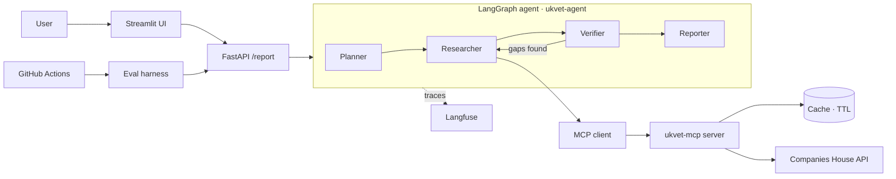

# Architecture

| Field | Value |
|---|---|
| Version | 0.1 (Proposed — revisit after the API spike) |
| Owner | Fraidoon Omarzai |

---

## 1. System overview



## 2. Components

| Component | Responsibility | Does NOT do |
|---|---|---|
| **ukvet-mcp** (PyPI package) | Wrap Companies House endpoints as MCP tools; auth, rate limiting, retries, caching; normalise "no data" responses | Any reasoning or LLM calls |
| **Planner** | Turn the user request into a list of checks (which of Q1–Q10 apply); resolve company name → number | Call data tools beyond search |
| **Researcher** | Call MCP tools; collect raw facts, each tagged with its source record | Interpret or summarise |
| **Verifier** | Check every fact has a source; detect gaps and contradictions (e.g. profile flag vs endpoint); send back for more research if needed (max loops capped) | Write the report |
| **Reporter** | Produce the structured report from verified facts only; label assessments as opinion | Use any fact not in the verified set |
| **FastAPI** | HTTP interface, request validation, timeouts | Business logic |
| **Streamlit UI** | Input, show report, citations, disclaimer | Business logic |
| **Eval harness** | Run datasets through the API; score metrics M1–M9 | — |
| **Langfuse** | Traces: latency, tokens, cost, tool calls, errors | — |

## 3. Key data structures (draft)

**Fact** — the unit that flows through the agent:
```python
class Fact(BaseModel):
    question_id: str  # "Q1".."Q9"
    statement: str  # "Company status is 'active'"
    value: Any  # structured value
    source_endpoint: str  # "/company/01234567"
    source_field: str  # "company_status"
    retrieved_at: datetime
```

**Report** — final output, validated with Pydantic:
```python
class Report(BaseModel):
    company_number: str
    company_name: str
    facts: list[Fact]
    red_flags: list[RedFlag]  # each references Fact ids
    assessment: str  # labelled as opinion
    risk_level: Literal["low", "medium", "high", "insufficient_data"]
    missing_data: list[str]
    disclaimer: str
    attribution: str
```

**Rule:** the Reporter may only reference facts in `facts`. Any statement it makes that cannot be linked to a `Fact` counts as a hallucination (metric M2).

## 4. Request flow

1. User enters a company name or number.
2. Planner resolves it: a number goes straight through; a name triggers `search_company` and, if ambiguous, returns candidates for the user to choose.
3. Researcher calls tools. Independent calls (profile, officers, PSC, charges, insolvency, filings) run **in parallel**.
4. Q8: Researcher fetches appointments for current directors, capped (cap set after the spike).
5. Verifier checks coverage and consistency; at most N extra research loops.
6. Reporter writes the report; Pydantic validates it; on failure, one retry, then return an error.
7. Everything is traced in Langfuse.

## 5. Cross-cutting concerns

| Concern | Approach |
|---|---|
| Rate limits | Token-bucket limiter in ukvet-mcp; cache; fixtures for tests |
| Untrusted text | All API text wrapped in delimiters and treated as data in prompts |
| Errors | Typed errors from ukvet-mcp; "insufficient data" for missing data; never a silent guess |
| Config | Environment variables via `pydantic-settings`; `.env.example` documents all |
| Model choice | Abstracted behind one interface so the Phase 5 comparison is a config change |

## 6. Decisions

See `docs/adr/`:
- ADR-001 Use MCP for data access
- ADR-002 Use LangGraph for orchestration
- ADR-003 Initial LLM and model abstraction
- ADR-004 Caching strategy
- ADR-005 MCP server implementation

## 7. Open questions (resolve after spike)

- Q8 limits: max directors and appointments per report?
- Is one Verifier loop enough, or do we need up to 2?
- Can the Planner skip questions the user didn't ask, or always run all Q1–Q10?
